# Laboratorio 2 ARSW
## Integrantes: Edwin Yesid Rodriguez Maldonado, Guillermo Esteban Bernal Bonilla
## Presentado a: Diego Alfonso Prieto Torres
### Part I
Thread control with wait/notify. Producer/consumer
Check the operation of the program and run it. While this occurs, run jVisualVM and check the CPU consumption of the corresponding process. Why is this consumption? Which is the responsible class? 

Hay un alto consumo de la cpu porque tanto el el thread de consumidor como el Thread productor intentan usar la lista queue pues cada vez que puedan.
 
la clase responsable es "consumer" ya que esta al mismo tiempo que la clase producer intenta operar en la lista de numeros asi no pueda.

Make the necessary adjustments so that the solution uses the CPU more efficiently, taking into account that - for now - production is slow and consumption is fast. Verify with JVisualVM that the CPU consumption is reduced. 

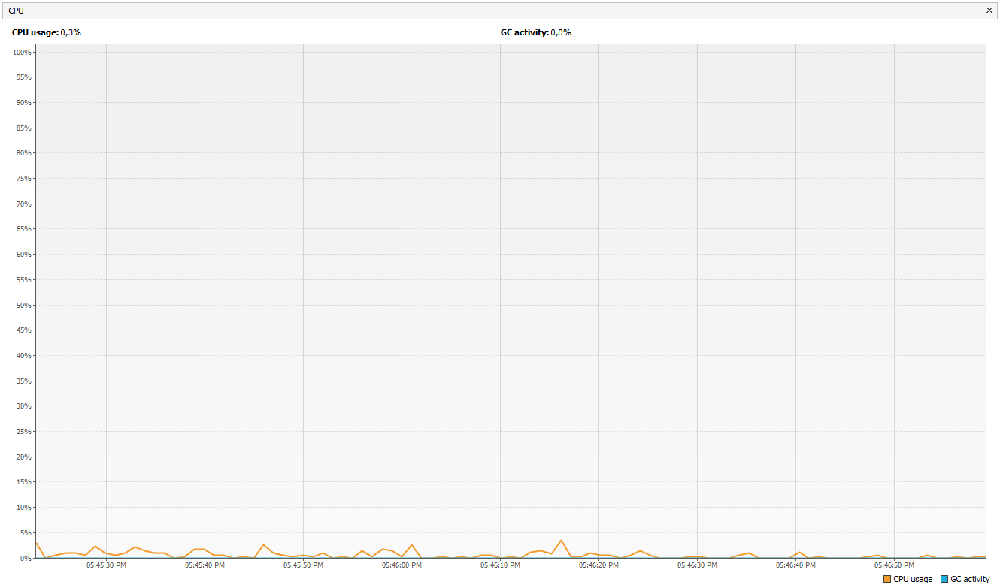

Make the producer now produce very fast, and the consumer consumes slow. Taking into account that the producer knows a Stock limit (how many elements he should have, at most in the queue), make that limit be respected. Review the API of the collection used as a queue to see how to ensure that this limit is not exceeded. Verify that, by setting a small limit for the 'stock', there is no high CPU consumption or errors.

### Parte II

1 Revise el programa "highlander-simulador", proporcionado en el paquete edu.eci.arsw.highlandersim. Este es un juego en el que:
 1 Tienes N jugadores inmortales. 
 2 Cada jugador conoce al jugador N-1 restante.
 3 Cada jugador ataca permanentemente a algún otro inmortal. El que ataca primero resta M puntos de vida a su oponente, y aumenta sus propios puntos de vida en la misma cantidad. 

2 Revise el código e identifique cómo se implementó la funcionalidad indicada anteriormente. Dada la intención del juego, una invariante debería ser que la suma de los puntos de vida de todos los jugadores sea siempre la misma (por supuesto, en un instante de tiempo en el que la operación de aumento/reducción de tiempo no esté en proceso). Para este caso, para N jugadores, ¿cuál debería ser este valor?

La sumatoria de la vida de cada inmortal = 100 * N(mortales)

3 Ejecute la aplicación y verifique cómo funciona la opción "pausa y comprobación". ¿Se cumple la invariante?

El boton no pausa sino que imprime la suma de la salud

4 Una primera hipótesis de que la condición de carrera para esta función (pausa y comprobación) se presenta es que el programa consulta la lista cuyos valores imprimirá, mientras que otros hilos modifican sus valores. Para corregir esto, haga lo que sea necesario para que, antes de imprimir los resultados actuales, todos los demás hilos se detengan. Además, implemente la opción "reanudar".

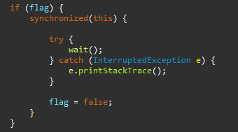

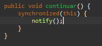

5 Vuelva a comprobar la operación (haga clic en el botón muchas veces). ¿Se cumple la invariante o no?.

cada valor se modifica en cada pause

6 Identificar posibles regiones críticas en relación con la lucha de los inmortales. Implementar una estrategia de bloqueo que evite las condiciones de carrera. Recuerda que si necesitas usar dos o más "bloqueos" simultáneamente, puedes usar bloques sincronizados anidados:

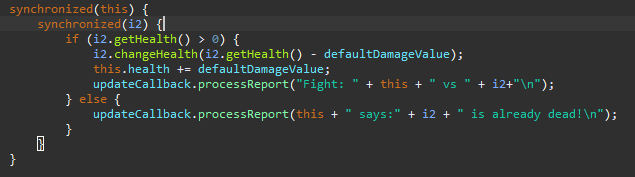

7 Después de implementar tu estrategia, comienza a ejecutar tu programa, y presta atención a si se detiene. Si es así, use los programas jps y jstack para identificar por qué el programa se detuvo.

Se detuvo ya que hubo un deadlock

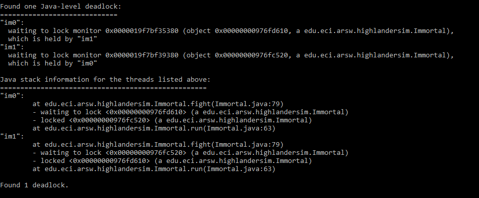

8 Considere una estrategia para corregir el problema identificado anteriormente (puede revisar el capítulo 15 de la Concurrencia en la práctica de Java de nuevo)

Para corregir el problema, se sincronizaran en el mismo orden que van

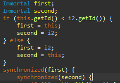

9 Una vez corregido el problema, rectifique que el programa sigue funcionando de forma consistente cuando se ejecutan 100, 1000 o 10000 inmortales. Si en estos grandes casos la invariante comienza a ser violada de nuevo, debes analizar lo que se hizo en el paso 4.

Con 100

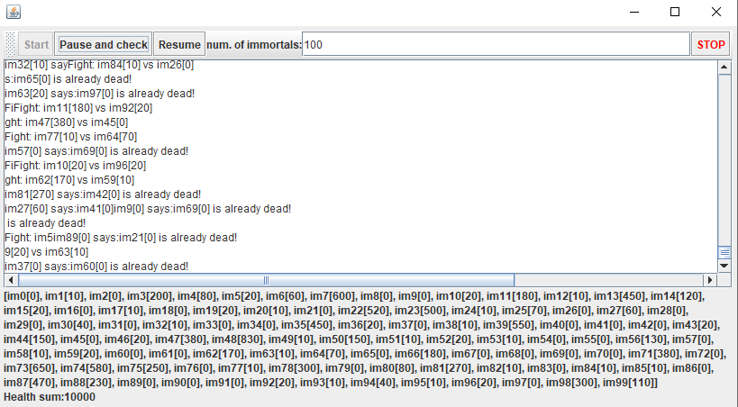

Con 1000

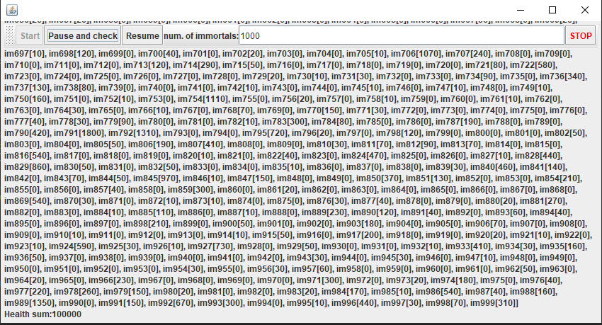

Con 10000

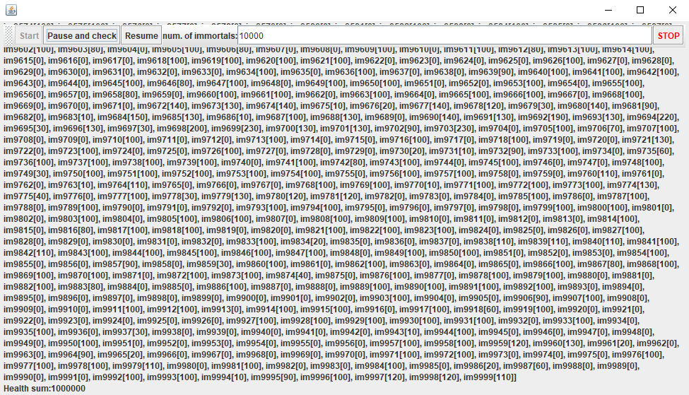

10 Un elemento molesto para la simulación es que en un cierto punto de la misma hay pocos "inmortales" vivos haciendo peleas fallidas con "inmortales" ya muertos. Es necesario suprimir a los muertos inmortales de la simulación a medida que mueren. 

Acá se muestra una forma de asegurar que no vaya a empezar el enfrentamiento si alguno de los dos ya esta muerto.

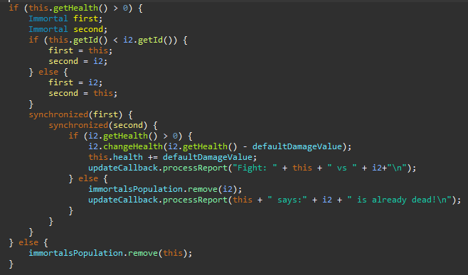

1 Analizando el esquema de operación de la simulación, ¿podría esto crear una condición de carrera? Implementar la funcionalidad, ejecutar la simulación y ver qué problema surge cuando hay muchos "inmortales" en ella. Escriba sus conclusiones al respecto en el archivo ANSWERS.txt.

En el archivo ANSWERS.txt se encuentra la respuesta

Acá mostramos la sincronización de la lista de inmortales

IMAGEN

2 Corregir el problema anterior SIN usar la sincronización, ya que hacer que el acceso a la lista compartida de inmortales sea secuencial haría que la simulación fuera extremadamente lenta.

Al no poder utilizar la sincronización lo que hacemos es utilizar la clase CopyOnWriteArrayList para obtener la lista concurrente la cual nos reducira el tiempo de ejecución y la sincrinizara de la mimsa manera sin hacer que el acceso a la lista sea de manera secuencial.

IMAGEN

11 Para terminar, implemente la opción STOP.

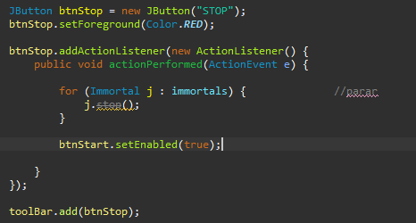

