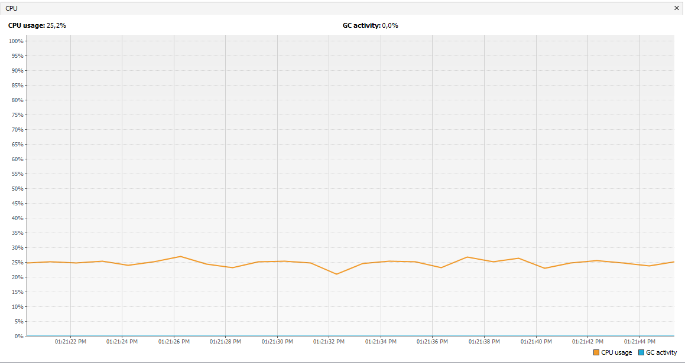

# Laboratorio 2 ARSW
## Part I
Thread control with wait/notify. Producer/consumer
Check the operation of the program and run it. While this occurs, run jVisualVM and check the CPU consumption of the corresponding process. Why is this consumption? Which is the responsible class? 

Hay un alto consumo de la cpu porque tanto el el thread de consumidor como el Thread productor intentan usar la lista queue pues cada vez que puedan.

